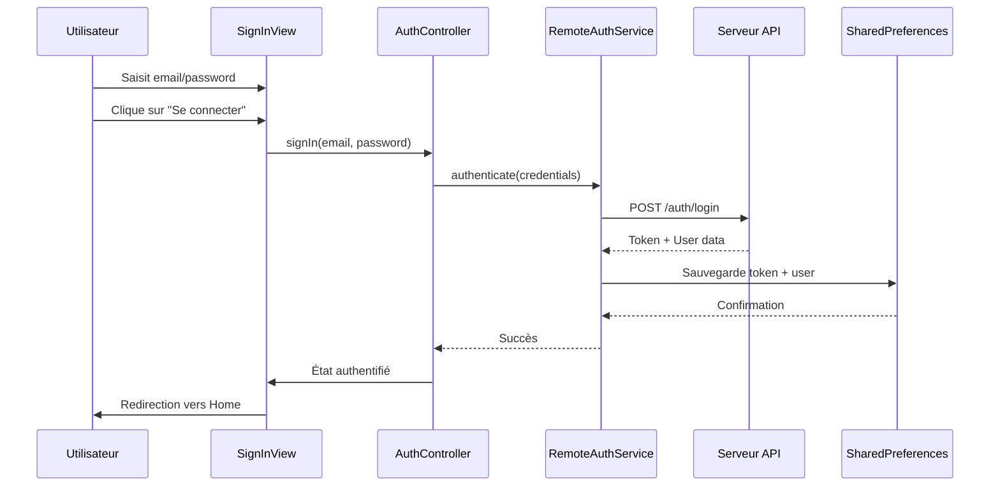
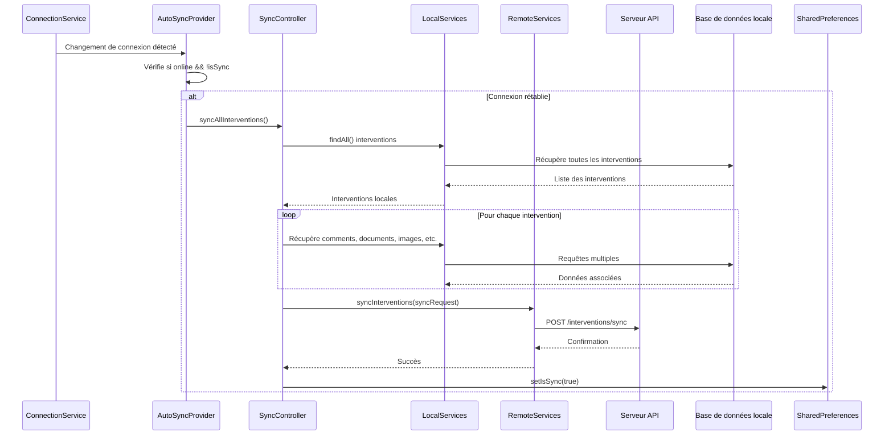
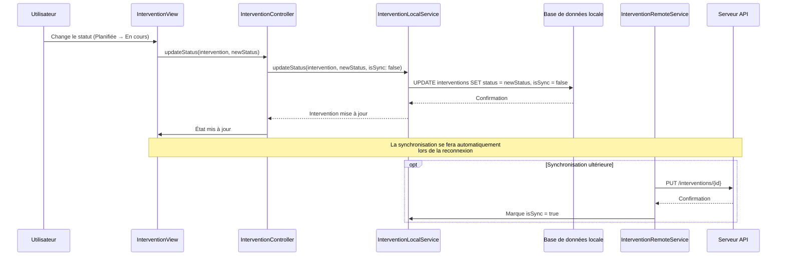
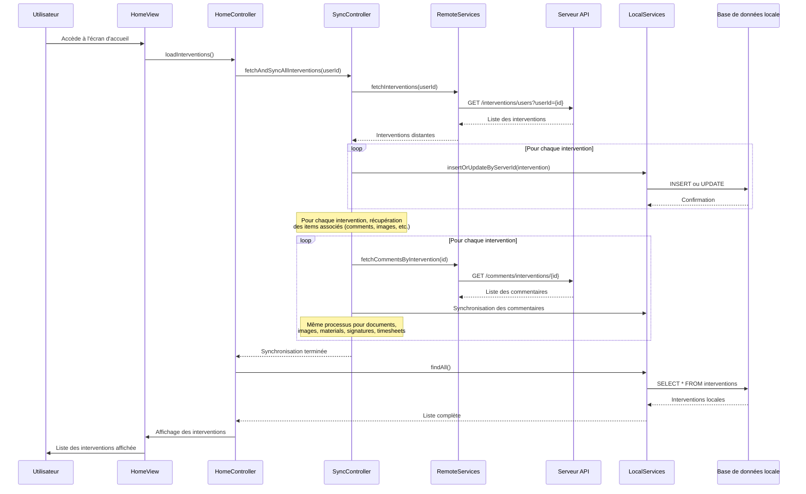

# Field Service

Application mobile Flutter pour la gestion d'interventions sur le terrain. Cette application permet aux techniciens de gérer leurs interventions, de capturer des photos, d'enregistrer des signatures, de suivre le temps de travail et de synchroniser les données avec le serveur, même en mode hors ligne.

## 📋 Table des matières

- [Prérequis](#prérequis)
- [Installation](#installation)
- [Configuration](#configuration)
- [Architecture](#architecture)
- [Fonctionnalités](#fonctionnalités)
- [Diagrammes de séquence](#diagrammes-de-séquence)
- [Commandes utiles](#commandes-utiles)

## 🔧 Prérequis

- Flutter SDK >= 3.8.1
- Dart SDK >= 3.8.1
- Android Studio / Xcode (pour le développement mobile)
- CocoaPods (pour iOS)
- Un éditeur de code compatible Dart (VS Code, Android Studio, IntelliJ)

## 🚀 Installation

1. **Cloner le projet**
   ```bash
   git clone <url-du-repo>
   cd field_service
   ```

2. **Installer les dépendances**
   ```bash
   flutter pub get
   ```

3. **Configurer les variables d'environnement**
   
   Créer un fichier `.env` à la racine du projet avec le contenu suivant :
   ```env
   BASE_URL=http://192.168.50.99:3000/api
   ```

4. **Générer les fichiers de code**
   ```bash
   make build_runner
   flutter gen-l10n
   ```

## ⚙️ Configuration

### Variables d'environnement

Le projet utilise `envied` pour gérer les variables d'environnement. Créer un fichier `.env` à la racine du projet :

```env
BASE_URL=http://votre-serveur.com/api
```

Les variables sont injectées à la compilation via `app_config.dart`.

### Permissions

L'application nécessite les permissions suivantes :

- **Android** (`AndroidManifest.xml`) :
  - `CAMERA` : Pour capturer des photos
  - `READ_EXTERNAL_STORAGE` / `READ_MEDIA_IMAGES` : Pour accéder aux images
  - `INTERNET` : Pour la synchronisation avec le serveur
  - `ACCESS_NETWORK_STATE` : Pour vérifier la connectivité

- **iOS** (`Info.plist`) :
  - `NSCameraUsageDescription` : Pour capturer des photos
  - `NSPhotoLibraryUsageDescription` : Pour accéder à la bibliothèque photo

## 🏗️ Architecture

L'application suit une architecture en couches inspirée de Clean Architecture :

```
lib/
├── main.dart                          # Point d'entrée de l'application
├── src/
│   ├── field_service_app.dart        # Widget racine de l'application
│   ├── common/                        # Code commun réutilisable
│   │   ├── config/                   # Configuration de l'application
│   │   ├── exceptions/               # Gestion des exceptions
│   │   ├── theme/                    # Thème et widgets thématisés
│   │   └── utils/                    # Utilitaires
│   ├── localization/                 # Internationalisation (i18n)
│   ├── models/                       # Modèles de données
│   │   ├── constants/                # Constantes (URLs, statuts, etc.)
│   │   ├── do/                       # Domain Objects (entités Drift)
│   │   ├── dto/                      # Data Transfer Objects
│   │   └── factory/                  # Factories de conversion DO ↔ DTO
│   ├── repository/                   # Couche d'accès aux données
│   │   ├── local/                    # Repositories locaux (Drift/SQLite)
│   │   └── remote/                   # Repositories distants (API REST)
│   ├── services/                     # Couche métier
│   │   ├── applying/                 # Services applicatifs
│   │   │   ├── local/                # Services locaux
│   │   │   └── remote/               # Services distants
│   │   └── technical/                # Services techniques
│   │       ├── app_shared_preferences.dart
│   │       ├── connection_service.dart
│   │       └── location_service.dart
│   ├── presentation/                 # Couche présentation
│   │   ├── controller/               # Controllers Riverpod (logique métier UI)
│   │   ├── view/                     # Écrans de l'application
│   │   └── widget/                   # Widgets réutilisables
│   └── routing/                      # Navigation (GoRouter)
```

### Couches de l'architecture

#### 1. **Models** (`lib/src/models/`)
- **DTO (Data Transfer Objects)** : Modèles pour la communication avec l'API
- **DO (Domain Objects)** : Entités de la base de données locale (Drift)
- **Factory** : Conversion entre DTO et DO

#### 2. **Repository** (`lib/src/repository/`)
- **Local Repository** : Accès à la base de données SQLite via Drift
- **Remote Repository** : Appels API REST

#### 3. **Services** (`lib/src/services/`)
- **Local Services** : Logique métier pour les opérations locales
- **Remote Services** : Logique métier pour les opérations distantes

#### 4. **Presentation** (`lib/src/presentation/`)
- **Controllers** : Gestion de l'état avec Riverpod
- **Views** : Écrans de l'application
- **Widgets** : Composants UI réutilisables

### Gestion de l'état

L'application utilise **Riverpod** pour la gestion de l'état :
- `@riverpod` : Providers avec code generation
- `@Riverpod(keepAlive: true)` : Providers persistants
- Separation des concerns : Controllers pour la logique, Views pour l'UI

### Base de données locale

**Drift** (anciennement Moor) est utilisé pour la gestion de la base de données SQLite locale :
- Schéma défini via des classes Dart
- Migration automatique
- Type-safe queries

Tables principales :
- `Interventions` : Interventions
- `Comments` : Commentaires
- `Documents` : Documents
- `Images` : Images
- `Materials` : Matériaux
- `Signatures` : Signatures
- `Timesheets` : Feuilles de temps

## ✨ Fonctionnalités

### 1. Authentification
- Connexion avec email/mot de passe
- Récupération de mot de passe
- Gestion de la session utilisateur
- Authentification biométrique (optionnelle)

### 2. Gestion des interventions
- Liste des interventions assignées à l'utilisateur
- Détails d'une intervention (titre, description, dates, localisation)
- Statuts : Planifiée, En cours, Terminée
- Filtrage et recherche

### 3. Synchronisation automatique
- Synchronisation automatique lors de la reconnexion
- Mode hors ligne : travail possible sans connexion
- Synchronisation bidirectionnelle (local ↔ serveur)
- Indicateur de statut de synchronisation

### 4. Capture de données
- **Photos** : Capture et ajout de photos aux interventions
- **Signatures** : Capture de signature client
- **Documents** : Ajout de documents PDF/autres
- **Commentaires** : Ajout de commentaires textuels

### 5. Gestion des matériaux
- Liste des matériaux disponibles
- Ajout/suppression de matériaux à une intervention
- Suivi des matériaux utilisés

### 6. Suivi du temps
- Enregistrement des temps de travail
- Feuilles de temps (timesheets)
- Chronomètre pour le suivi en temps réel

### 7. Géolocalisation
- Affichage de la localisation des interventions
- Navigation vers l'intervention

## 📊 Diagrammes de séquence

### 1. Authentification



### 2. Synchronisation automatique



### 3. Mise à jour du statut d'une intervention



### 4. Récupération initiale des interventions



## 🛠️ Commandes utiles

### Génération de code

```bash
# Générer tous les fichiers de code (Drift, Riverpod, Freezed, etc.)
make build_runner

# Générer en mode watch (regénération automatique)
make build_runner_watch

# Nettoyer les fichiers générés
make build_runner_clean

# Générer les fichiers de localisation
make gen_l10n
```

### Analyse du code

```bash
# Analyser le code avec Dart Code Metrics
make analyze_all
```

### Build et déploiement

```bash
# Build Android (staging)
make build_android_staging

# Déployer Android (staging)
make deploy_android_staging

# Build iOS (staging)
make build_ios_staging

# Déployer iOS (staging)
make deploy_ios_staging
```

### Autres commandes Flutter

```bash
# Lancer l'application
flutter run

# Lancer sur un appareil spécifique
flutter run -d <device-id>

# Build APK Android
flutter build apk --release

# Build iOS
flutter build ios --release

# Exécuter les tests
flutter test

# Analyser le code
flutter analyze

# Formater le code
flutter format .
```

## 📦 Technologies principales

- **Flutter** : Framework de développement cross-platform
- **Riverpod** : Gestion d'état réactive
- **Drift** : ORM pour SQLite (base de données locale)
- **GoRouter** : Navigation déclarative
- **Freezed** : Génération de code pour les modèles immutables
- **Reactive Forms** : Gestion de formulaires réactifs
- **Local Auth** : Authentification biométrique
- **HTTP** : Client HTTP pour les appels API

## 🔐 Sécurité

- Stockage sécurisé des tokens d'authentification
- Chiffrement des données sensibles
- Validation des entrées utilisateur
- Gestion des erreurs et exceptions

## 📝 Notes de développement

- Les fichiers générés (`.g.dart`, `.freezed.dart`) ne doivent pas être modifiés manuellement
- Toujours exécuter `make build_runner` après modification des annotations
- La base de données locale utilise une stratégie de migration simple (reconstruction des tables si nécessaire)
- La synchronisation est déclenchée automatiquement lors de la reconnexion réseau

## 🤝 Contribution

1. Créer une branche pour votre fonctionnalité
2. Commiter vos changements
3. Pousser vers la branche
4. Ouvrir une Pull Request

## 📄 Licence

[Spécifier la licence du projet]
